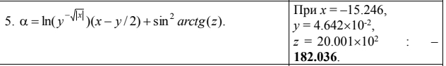
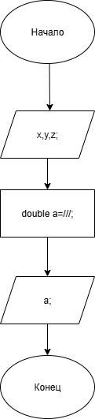

# homework-5-Lab

### Условие задачи

!

### Алгоритм
1. **Начало**
2. Задать данные:
   - `x` - переменная.
   - `y` - переменная.
   - `z` - переменная.
3. Решение выражения
4. Вывод результата:
   - `a` - находимое значение.
5. **Конец**

### Блок-схема
!
(https://app.diagrams.net/?tags=%7B%7D&lightbox=1&highlight=0000ff&edit=_blank&layers=1&nav=1&title=%D0%94%D0%B8%D0%B0%D0%B3%D1%80%D0%B0%D0%BC%D0%BC%D0%B0%20%D0%B1%D0%B5%D0%B7%20%D0%BD%D0%B0%D0%B7%D0%B2%D0%B0%D0%BD%D0%B8%D1%8F.png&dark=auto#R%3Cmxfile%3E%3Cdiagram%20name%3D%22%D0%A1%D1%82%D1%80%D0%B0%D0%BD%D0%B8%D1%86%D0%B0%20%E2%80%94%201%22%20id%3D%22vKg7L8X21BIwSFlcxruJ%22%3E7Vhdb9owFP01eeyUD0jgERJKq6kSGlrXPiE3cRNrToyMgcCv3w1xSIxTYN3oqq4SsnyPP%2B%2B5515HGI6f5mOO5skdizA1bDPKDScwbLvXd6EtgE0JWK7VKZGYk0hiNTAlWyxBU6JLEuGFMlEwRgWZq2DIsgyHQsEQ52ytTntmVD11jmKsAdMQUR39QSKRSL9sr8ZvMImT6mTL7ZcjKaomS08WCYrYugE5I8PxOWOi7KW5j2lBXsVLue76hdH9xTjOxDkL%2FJvu1%2B%2Fe%2Feyqdzub3QuSJMy5sstdVogupcNGYBr9oGiHphFYRs%2Br%2BtAOd%2B1IOiQ2FUtwEgQEjOE6IQJP5ygsRtagCcASkVKwLOjql5Z%2BrDAXOG9A0okxZikWfANT5KhjSkKlpCp%2B13V4rApLGqHpSQxJRcT7nWvSoCN5%2Bw0OOzqHGj9ZNCjECFZI0WJBQpUWzpZZhItDzGMk4UgRq05Rg4NuCwUVxjFFgqxUibfxIk%2BYMAI3qSPg2l%2B6Sgws84DcBVvyEMt1TVFqWznqRu7BRgLxGAtto12g9o6%2FPnZdLXa5Yfvgu7%2FdB6IRR8jhedGF2CBKMWUxRylMnGNO4CqYH45N6oFTqfFMclwVwAulyp7dU7lyGIW%2Fliu2015wBrKwFG1ZfLq74uO%2Bq1LT8d6w1lhP49noW8Yets7g9i6JJj85aqnXEVs%2BATdw1s6%2Blr8W8apF5h8U6rdUXyt7LeL7s0qNcyIeij7Uw9J6lPOKfpA3pgWbysjAlcaiwnxsjtXLdla17sWIlLX2dJErS%2Blpcb2TV8bqqfLxrFe%2BMSBEZSP3cm9MK6369wH6gG%2BLc25tvFh262%2F5R8vuY1l7Mrs7n9l9iez2%2Fk%2FVdXTVHf3g%2B5TdubIDs%2F5ToJxe%2F7XijH4B%3C%2Fdiagram%3E%3C%2Fmxfile%3E)

### 2. Реализация программы

    #include <stdio.h>
    
    #include <locale.h>
    
    #include <math.h>
    
    #define _USE_MATH_DEFINES 
    
    int main()
    
    {
    
	  setlocale(LC_CTYPE, "");
    
	  float x, y, z;
    
	  puts("Введите значение: x, y, z");
    
	  scanf("%f %f %f", &x, &y, &z);
    
	  //float x, y, z;
    
	  //x = -15.246;
    
	  //y = 0.04642;
    
	  //z = 2000.1;
    
	  double a;
    
	  a = log(pow(y,-sqrt(fabs(x))))*(x-(y/2))+sqrt(sin(atan(z)));
    
	  printf("a принимает значение: %.3lf \n", a);
    
	  return 0;
    
    }

 ### 3. Результаты работы.

     Введите значение: x, y, z
     
    -15.246 0.04642 2000.1
    
    a принимает значение: -182.036

### 4. Информация о разработчике 

Гусев Иван бИЦ-251
